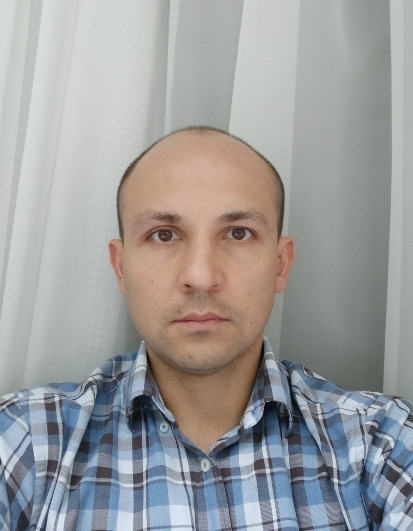

# Резюме
# Аскар Минигалиев

## *Контактная информация:*

#### Телефон: +382 68 647 137
#### E-mail: askarikus@yandex.ru
#### Telegram: @AskarMini
#### GitHub: Askarikus

## *О себе:*
Ищу работу на полный рабочий день/part time/гибкий график.

## *Опыт работы:*

### Backend Developer (Symfony) в ООО "Wahelp"
**Период:** 3 года 3 месяца
**Уровень:** Продвинутый
**Руководитель:** [@eva4ceo](https://t.me/eva4ceo)

**Технический стек:**
- PHP 8.1, Symfony 6
- PostgreSQL 15, Redis, RabbitMQ
- Docker, Nginx
- Vue.js
- Git

**Ключевые достижения и обязанности:**
- Разработка и поддержка backend-части веб-приложений на Symfony
- Интеграция с внешними CRM-системами (AMO Crm, Yclients)
- Интеграция с мессенджерами (Telegram, WhatsApp через Green API)
- Оптимизация производительности приложений
- Взаимодействие с командой разработки и другими отделами
- Настройка и работа с Grafana+Loki для мониторинга

## *Опыт нагрузочного тестирования:*

### Инженер по нагрузочному тестированию
**Период:** полугодовая стажировка в [PerformanceLab](https://www.performance-lab.ru/)

**Ключевые навыки и достижения:**
- Разработка и выполнение тестовых сценариев в JMeter для веб-приложений и API
- Создание сложных скриптов с использованием:
  - Переменных и параметризации запросов
  - Обработчиков предварительной и последующей обработки (Pre/Post Processors)
  - Ассертов для валидации ответов
  - Пользовательских функций на Groovy/Java
- Анализ результатов тестирования и выявление узких мест производительности
- Оптимизация запросов и выявление проблем с производительностью
- Настройка распределенного тестирования
- Интеграция с CI/CD (Jenkins)
- Подготовка отчетов и рекомендаций по оптимизации

**Инструменты:** JMeter, Grafana, InfluxDB, Jenkins, Git

## *Проекты для саморазвития:*

### Решение алгоритмических задач на Codewars (4 kyu)
**Профиль:** [Askarikus](https://www.codewars.com/users/Askarikus)

**Достижения и навыки:**
- Решение более 50+ задач различной сложности
- Достижение ранга 4 kyu
- Изучение и применение различных алгоритмов и структур данных
- Оптимизация кода по времени и памяти
- Работа с тестами и edge cases

**Используемые технологии:**
- Python, PHP
- Алгоритмы и структуры данных
- Функциональное программирование
- Оптимизация производительности

## *Проекты для саморазвития:*
- Участие в проекте Real World (https://github.com/gothinkster/realworld)
  - Реализация сервиса на Symfony(https://github.com/Askarikus/realworld-starter-kit-backend-symfony.git)
  - Реализация сервиса на Laravel(https://github.com/Askarikus/realworld_laravel.git)
  - Разработка фронтенд-части на Vue.js(https://github.com/Askarikus/vue3-askar.git)
  - [MonteRent](https://github.com/Askarikus/MonteRent.git) - Платформа аренды недвижимости
- **Парсер Telegram-каналов недвижимости**
  - Разработка системы парсинга объявлений из Telegram-каналов
  - Backend на Symfony для первичной обработки и сохранения объявлений
  - Интеграция с ИИ-сервисом для анализа и оценки недвижимости
  - Реальный проект: [budva.arenda.live](https://budva.arenda.live)

## *Образование:*
**Уфимский государственный авиационный технический университет**
Факультет: Информационно-измерительная техника и технологии
Год окончания: 2005
Квалификация: Высшее образование

## *Языки:*
- Русский — родной
- Английский — A2 (Pre-Intermediate)
